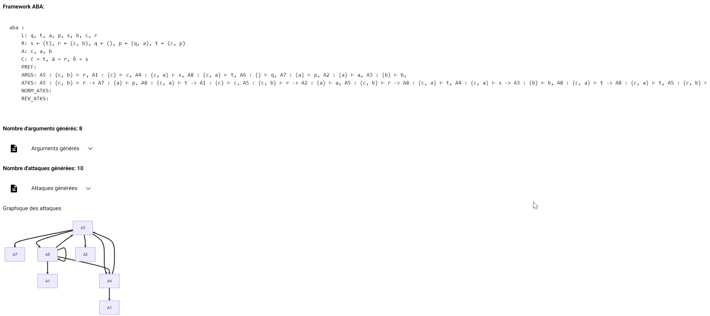
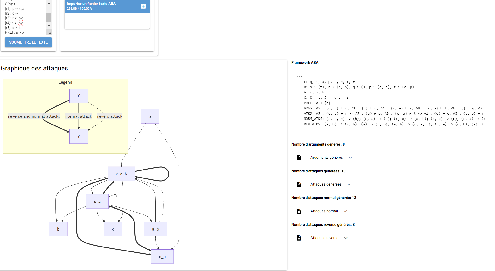

# Labwork Report : ABA framework & Binary argument classification
This document reports on our lab work focused on **Argumentation Theory**, specifically the automatic generation of an ABA+ framework and the process of binary classification on pairs of textual arguments. Our approach includes the development of a web-based interface where users can input an ABA+ framework with preferences and compute the arguments and attacks.

The implementation of the **ABA+ framework** generation, as well as the binary classification of argument pairs, can be found on this GitHub repository. The repository includes code for:

- **Automatic Generation of ABA+ Frameworks**: The code provides functionalities to generate ABA+ frameworks based on user-defined preferences and arguments.
- **Binary Classification of Textual Arguments**: This feature applies a machine learning classifier to predict whether an argument source attacks or supports an argument target. The classification process utilizes DistilBERT for argument pair classification.
- **Web Interface for Argument Input and Attack Computation**: A simple web interface allows users to interact with the framework. The input consists of arguments and their relationships, and the output computes attacks, displayed visually on the page.

## Installation

```bash
conda create -f environment.yml
conda activate dynco
pip install -e .
```


# Download the model

You can download the model from [here](https://drive.google.com/file/d/1joE47zPDHDL4e5hT0eTYv5c8AGP2MMlK/view?usp=sharing)
unzip it in ur folder like this 
```
├───ape
│   ├───kialo
├───ape.egg-info
├───data
│   └───kialo
│       └───debates
│           ├───de
│           ├───en
│           ├───fr
│           ├───it
│           └───sk
├───outputs
│   └───best_model
```

## Website interface

Our [website](https://ape-yz5e.onrender.com/) looks like this :



You can provide your framework like this :


You can copy this or use file import to provide your framework. example of file [here](data/test_aba.txt) : 
```
L: [a,b,c,q,p,r,s,t]
A: [a,b,c]
C(a): r
C(b): s
C(c): t
[r1]: p <- q,a
[r2]: q <- 
[r3]: r <- b,c
[r4]: t <- p,c
[r5]: s <- t
PREF: a > b
```

## Authors
Abdurrahman SEN  
Emilien Komlenovic  
Pierre-Emmanuel Marrel
